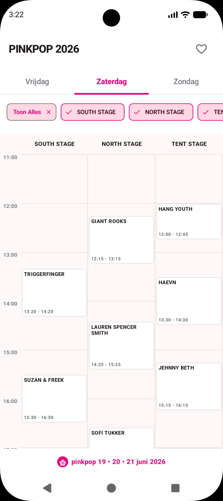
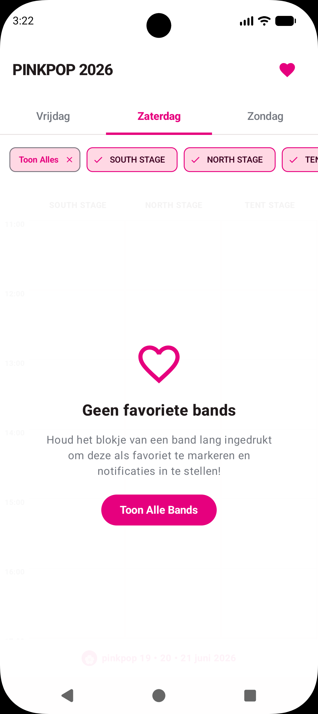
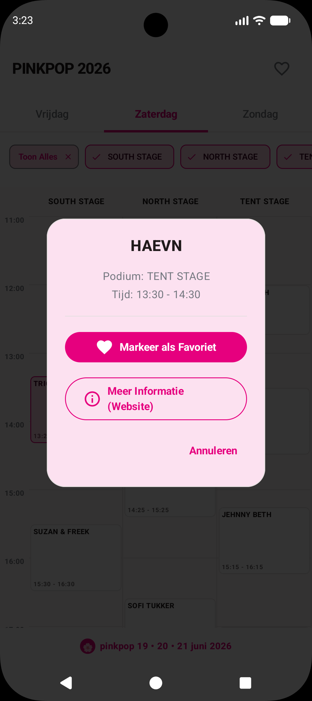
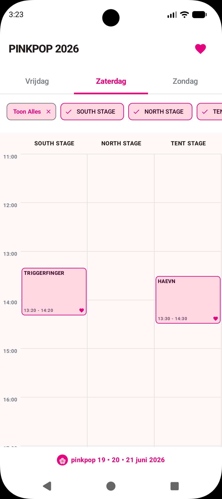
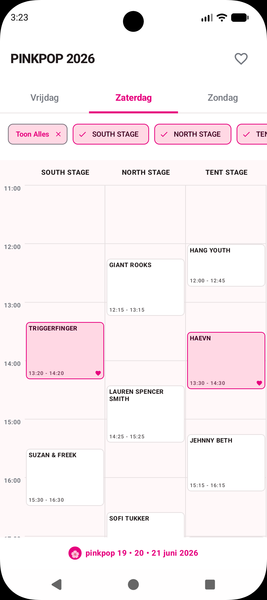

# Pinkpop 2026 Timetable App

This application provides a comprehensive timetable for the Dutch festival Pinkpop 2026.

## Background and Goals

This app was created as an experiment to test the capabilities of **Google's AI Studio**. The primary goal was to see how well a fully functional Android application could be built using *only prompts*, with absolutely zero manual coding involved. Furthermore, this was achieved using only the **Gemini 3.5 Flash** model (not the Pro version).

The entire application was finished within a couple of hours. After the initial prompt provided the foundation, the app was refined through a series of small, targeted prompts to adjust specific details. Interestingly, the most challenging part of the project wasn't the coding itself, but rather sourcing and formatting the correct data for the Pinkpop festival lineup.

## Features
- **Daily Overview:** Get a clear, organized view of the schedule for each day.
- **Stage Filtering:** Easily filter the lineup by specific stages.
- **Favorites & Notifications:** Mark artists as your favorites and receive a notification 30 minutes before their performance starts.
- **Artist Details:** Direct punch-out links to the official festival website to read more about the artists.

## Screenshots

  
  
  
  
  

## Run Locally

**Prerequisites:**  [Android Studio](https://developer.android.com/studio)

1. Open Android Studio
2. Select **Open** and choose the directory containing this project
3. Allow Android Studio to fix any incompatibilities as it imports the project.
4. Create a file named `.env` in the project directory and set `GEMINI_API_KEY` in that file to your Gemini API key (see `.env.example` for an example)
5. Remove this line from the app's `build.gradle.kts` file: `signingConfig = signingConfigs.getByName("debugConfig")`
6. Run the app on an emulator or physical device
